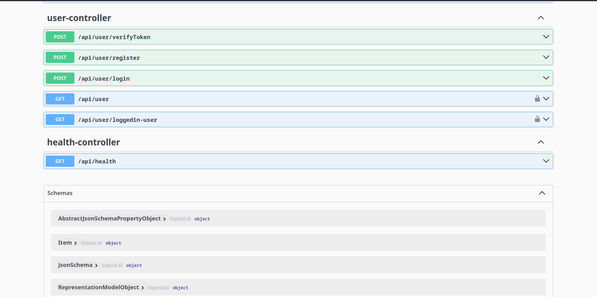

# 🥷 Kage Pass – Shadow Pass Authentication System

> *"In the realm of shadows, only those with the secret pass may enter."*  
> **Kage Pass** (影パス) – inspired by the Japanese word *kage* (shadow) and the silent grace of ninjas – is a lightweight, in-house **JWT-based authentication** system.  
> Built with the latest and OG **Java 24** and **Spring Boot 3.3**, it is your stealthy starter kit for any application that requires secure user authentication.

**Directly Compatible with jwt-auth-ui out of the box:** https://github.com/sagarkpro/jwt-auth-ui

**Swagger**

---

## 🗿 Philosophy

Like a ninja’s hidden path, **Kage Pass** grants access only to those who possess the secret token.  
It operates silently in the background, yet its protection is unbreakable – a perfect companion for your next secure application.

---

## ⚔️ Features

- **Register** – Create a new account and gain your shadow pass.
- **Login** – Receive a JWT token for secure access.
- **Find Users** – Search and retrieve user details.
- **Edit User** – Update user information with precision.
- **Secure JWT Middleware** – Token validation for every guarded route.

---

## 🏯 Tech Stack

- **Java 24**
- **Spring Boot 3.3**
- **Spring Security**
- **JWT (JSON Web Token)**
- **Maven**
- **MariaDB (configurable)**
